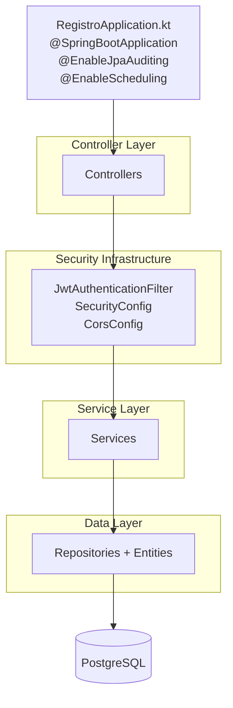

# Backend - Introducción

## Descripción General

El backend de **CLIAS** está construido en **Spring Boot 3.4.2 + Kotlin 1.9.22** y sigue una arquitectura en capas (Controller → Service → Repository → Entity/DTO) con **Spring Security (JWT)**, **Spring Data JPA** y soporte para tareas programadas (`@Scheduled`) y auditoría JPA.

Reside en la carpeta **`clias-backend/`** del workspace.

**Punto de entrada**

- `RegistroApplication.kt` con `@SpringBootApplication`, `@EnableJpaAuditing` y `@EnableScheduling`.

**Funcionalidades Actuales**

- **Autenticación y cuentas**: registro/login JWT, gestión de perfiles (AuthController, CuentaUsuarioController).
- **Pacientes y profesionales**: CRUD y flujo clínico básico (PacienteController, MedicoController).
- **Examen VPH**: registro, seguimiento y resultados (ExamenVphController, EvolucionController).
- **Encuestas y datos complementarios**: SUS e información socioeconómica (EncuestaSusController, InformacionSocioeconomicaController).
- **Dispositivos y estados (SISA)**: vinculación app-usuario, QR, estados y dispositivos de automuestreo registrados.
- **Ubicación/Mapa**: captura/consulta de ubicaciones de uso de la app (UbicacionController).
- **Notificaciones**: envío PUSH vía Firebase y programación de notificaciones.
- **Recursos y archivos**: carga/descarga y contenidos de apoyo.
- **Salud sexual**: contenidos y endpoints temáticos.
- **Sesión de chat**: almacenamiento/consulta de sesiones.

> Documentación técnica extensa: **[DeepWiki – TelemedicinaBE](https://deepwiki.com/chr1s23/TelemedicinaBE/1-overview)**

## Estructura del proyecto

### Árbol de paquetes (vista lógica)

- `com.crisordonez.registro`
  - `configuration`
    - `SecurityConfig` → reglas de seguridad, endpoints públicos/privados.
    - `JwtAuthenticationFilter` → validación de token y carga de usuario.
    - `CorsConfig` → orígenes permitidos para web y app móvil.
    - `FirebaseConfig` → inicialización de SDK para notificaciones PUSH.
    - `AppExceptionHandler` → manejo unificado de errores (HTTP → JSON).
  - `controller`
    - `RootController` (`/`, `/health`)
    - `AuthController`, `CuentaUsuarioController`, `AdministradorController`
    - `PacienteController`, `MedicoController`
    - `ExamenVphController`, `EvolucionController`, `AnamnesisController`
    - `EncuestaSusController`, `InformacionSocioeconomicaController`, `SaludSexualController`
    - `DispositivoAppUsuarioController`, `DispositivoRegistradoController`, `EstadoDispositivoController`
    - `CodigoQRController`, `ArchivoController`, `RecursoController`
    - `NotificacionController`, `SesionChatController`, `UbicacionController`
    - **FHIR (solo lectura)**: `PacienteFhirController`, `MedicoFhirController`, `ExamenVphFhirController`, `EvolucionFhirControlller`, `SaludSexualFhirController`, `SesionChatFhirController`, `ArchivoFhirController`
  - `service`
    - Servicios por dominio + sus `*ServiceInterface`
    - **Notificaciones**: `PushNotificationService`, `NotificacionService`
    - **Programación**: `schedule/*` para tareas con `@Scheduled`
  - `repository`
    - Repositorios Spring Data (PacienteRepository, MedicoRepository, etc.)
  - `model`
    - `entities/` → entidades JPA
    - `dtos/` → DTOs de entrada/salida
    - `requests/` y `responses/` → contratos de API
    - `enums/` → estados y catálogos
    - `mapper/` → conversión Entity ↔ DTO
    - `errors/` → tipos de error
  - `utils`
    - `JwtUtil`, `MensajesNotificacion`, utilidades comunes

### Recursos

- `src/main/resources`
  - `application.properties`
  - `logback.xml`
  - `registro.postman_collection`
  - `static/` — versionado solo `favicon.ico`. Sin Thymeleaf (no hay `templates/`). En despliegue se copia el build de `clias-admin` en `static/web/` y el backend lo sirve en `/web/` (el `JwtAuthenticationFilter` deja pasar `/web/**` sin token)
  - **Credenciales Firebase** (JSON, no versionadas)

## Diagrama de arquitectura (alto nivel)

:::note Regla de diseño
Por cada **entidad/tabla principal** del dominio hay **al menos** un **Controller** (endpoints REST del módulo), un **Service** (lógica de negocio), un **Repository** (acceso a datos) y sus **Entity/DTOs**. Algunos controladores agregan varias entidades (p. ej. **Notificaciones** usa `Notificacion` y `NotificacionProgramada`).
:::

