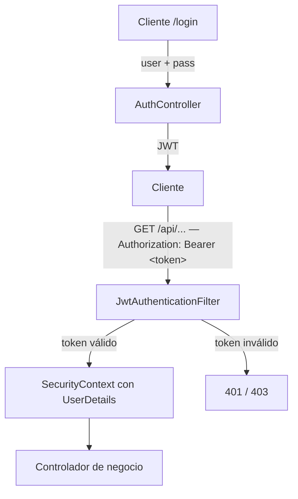

# Backend - Seguridad

## Enfoque general

- **Autenticación**: el usuario se loguea (p. ej. `/api/auth/login`) y recibe un **JWT**.
- **Autorización**: en cada request posterior el cliente envía el header `Authorization: Bearer <token>`.

Un **filtro** (`JwtAuthenticationFilter`) valida el token y, si es correcto, **autentica** la petición en el `SecurityContext`.

- **Sin sesión de servidor**: el token contiene la identidad; el servidor no guarda estado de sesión.

## Flujo de autenticación (alto nivel)

## Componentes clave de la configuración

### SecurityConfig

Puntos esenciales de la configuración (`@EnableWebSecurity`, `@EnableMethodSecurity`):

- **CORS**: bean `corsConfigurationSource()`. `allowedOriginPatterns`: `http://localhost:*`, `http://127.0.0.1:*`, `https://clias.ucuenca.edu.ec`. Métodos `GET, POST, PUT, PATCH, DELETE, OPTIONS`. Headers `Authorization, Content-Type, Accept, Origin, X-Requested-With`. Expone `Authorization`. `allowCredentials = true`. (La clase `CorsConfig` existe pero está **desactivada** — `//@Configuration`.)
- **CSRF**: deshabilitado (`csrf.disable()`), típico en APIs JWT.
- **Sesión**: sin estado de sesión de servidor; la identidad viaja en el JWT.
- **Filtro JWT**: `addFilterBefore(jwtAuthenticationFilter, UsernamePasswordAuthenticationFilter::class.java)`.
- **Autorización HTTP**: una lista de `permitAll()` seguida de `anyRequest().authenticated()`. **No hay `hasRole` en la cadena**; la autorización por rol se aplica método a método con `@PreAuthorize` gracias a `@EnableMethodSecurity`.
- **Autenticación**:
  - `UserDetailsService` propio (`CuentaUsuarioDetailService`)
  - `DaoAuthenticationProvider` + **BCrypt**
  - `AuthenticationManager = ProviderManager(authenticationProvider())`

### JwtAuthenticationFilter

- Extrae el token del header `Authorization`.
- Lo valida (firma, expiración, etc.) y, si es válido, **construye** un `UsernamePasswordAuthenticationToken` con el usuario/roles y lo deja en el `SecurityContext`.
- Si no hay token válido → la request llegará **no autenticada** y se aplican las reglas.
- **Rutas que el filtro ignora por completo** (no intenta validar token): las que empiezan por `/web/` — es la app **`clias-admin`** compilada, que se copia en `static/web/` al desplegar.

### CuentaUsuarioDetailService

- Carga el usuario desde la BD (por email/username).
- Debe devolver un `UserDetails` con **authorities**.
- Si usas `hasRole("ADMIN")`, la autoridad esperada es **`ROLE_ADMIN`**.

## Autorización por endpoint

### Rutas públicas (`permitAll`)

Tal como están declaradas hoy en `SecurityConfig`:

| Ruta | Nota |
|------|------|
| `/`, `/health` | Estado del servicio |
| `OPTIONS /**` | Preflight CORS |
| `/api/auth/login`, `/usuarios/registro`, `/usuarios/autenticar`, `/usuarios/validar`, `/usuarios/cambiar-contrasena`, `/usuarios/public-indent/*` | Autenticación y gestión de credenciales |
| `/archivo/nombre/**`, `/info-socioeconomica/ficha/existe/*` | Recursos públicos de la app móvil |
| `POST /dispositivo`, `GET /dispositivo/*` | Registro de token FCM (ocurre antes de la sesión completa) |
| `POST /notificaciones`, `POST /notificaciones/programadas` | Invocados por el scheduler interno y por `clias-notificaciones` |
| `GET`/`POST /api/codigosqr` | Códigos QR (admin web) |
| `/api/dispositivos_registrados/**` | Consulta de dispositivos |
| `GET /api/estado-dispositivos/**` | Panel de estado |
| `/api/ubicaciones/**` | Servicios de ubicación |
| `GET /api/pacientes/**` | Consulta de pacientes |
| `/prueba/medico/**`, `/prueba/admin/**` | Flujo médico y reporting |

:::warning Estado transitorio
Varias rutas de `clias-admin` (`/api/codigosqr`, `/api/estado-dispositivos`, `/prueba/**`, `/api/ubicaciones`) siguen **abiertas sin token** mientras se termina de migrar el frontend para enviar el JWT en cada petición. El objetivo es que solo `/api/auth/login`, `/health` y el registro de dispositivo queden públicos.
:::

### Resto de rutas

`anyRequest().authenticated()` — requieren JWT válido. La restricción por rol (ADMIN / DOCTOR / USER) se aplica en cada método con `@PreAuthorize`, no en `SecurityConfig`.

## Cómo proteger / agregar endpoints

1. Crea el endpoint en tu `@RestController`.
2. Si es **público**, añádelo a la lista de `permitAll()` en `SecurityConfig` (los matchers se evalúan en orden; pon las rutas más específicas arriba).
3. Si requiere **rol**, déjalo caer en `anyRequest().authenticated()` y anótalo con `@PreAuthorize("hasRole('ADMIN')")` (la autoridad esperada es `ROLE_ADMIN`).
4. Prueba con y sin token.
