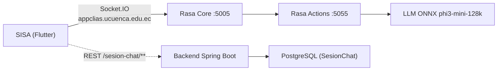

# Chatbot - Integración y Despliegue

Estado del chatbot en producción y cómo operan sus componentes (Rasa + acciones con LLM **phi3-mini-128k-onnx**).

> Carpeta del workspace: `clias-chatbot/`
>
> El `docker-compose.yml` levanta **solo el chatbot** (Rasa Core + Actions); el backend y PostgreSQL viven en su propio despliegue.
>
> - `clias-chatbot-rasa-core` → `rasa/rasa:3.6.2-full`, contenedor `:5005`, publicado en `127.0.0.1:5015` (nginx expone `https://appclias.ucuenca.edu.ec`)
> - `clias-chatbot-rasa-actions` → acciones personalizadas, `expose: 5055` (solo red interna)
> - Red Docker: `clias-chatbot-network` (bridge)

## Estructura del proyecto

```
clias-chatbot/
├─ actions/                    # Acciones personalizadas (Python)
│  ├─ cpu_and_mobile/          # Modelo phi3-mini-128k-onnx
│  ├─ actions.py               # Acciones (fallback/generación con LLM)
│  ├─ __init__.py
│  ├─ Dockerfile
│  └─ requirements.txt
├─ data/                       # Datos de entrenamiento NLU/Core
│  ├─ nlu.yml
│  ├─ rules.yml
│  └─ stories.yml
├─ models/                     # Modelos Rasa entrenados (.tar.gz, con fecha)
├─ results/                    # Reportes NLU (matriz de confusión, intent_report.json)
├─ tests/                      # test_nlu.yml, test_stories.yml
├─ config.yml                  # Pipeline NLU + políticas Core
├─ credentials.yml             # Canales: rest + socketio
├─ domain.yml                  # Intents, entities, slots, responses, actions (~210 KB)
├─ endpoints.yml               # action_endpoint
└─ docker-compose.yml          # Orquestación (rasa-core + rasa-actions)
```

*(`docker-compose.old.yml` y `endpoints.old.yml` son versiones anteriores con el backend embebido.)*

## Integración real (App ↔ Rasa)

- La **app SISA (Flutter)** se conecta **directamente** a Rasa por el **canal `socketio`** (`socket_io_client`) contra `https://appclias.ucuenca.edu.ec` (nginx → `127.0.0.1:5015` → `rasa-core:5005`). Eventos: `user_uttered` (cliente → bot) y `bot_uttered` (bot → cliente), con `session_persistence: true`.
- El **backend** persiste la metadata de la sesión de chat en PostgreSQL (`SesionChat`) vía REST (`/sesion-chat/**`), a partir de lo que le envía la app.
- **Rasa** decide la respuesta:
  - Si hay intent claro, responde con **plantillas** (`responses` de `domain.yml`) o **acciones**.
  - Si no, entra **fallback** → llama a **`rasa-actions`**; allí `actions.py` usa **phi3-mini-128k-onnx** para generar una respuesta controlada por **prompt** (seguridad temática).



## Puntos clave de integración

### 1) docker-compose.yml

- Levanta **2 contenedores** en la red `clias-chatbot-network`:
  - `clias-chatbot-rasa-core` (`rasa/rasa:3.6.2-full`): `command: run --enable-api --cors "https://clias.ucuenca.edu.ec" --endpoints endpoints.yml --port 5005`. Monta `./:/app`. Publicado en `127.0.0.1:5015:5005`.
  - `clias-chatbot-rasa-actions` (build desde `./actions/Dockerfile`): `expose: 5055` (sin puerto en el host).
- **Qué ajustar:** el `--cors` debe incluir el origen que consume el socket. Si cambias el nombre/puerto del servicio de acciones, actualiza `endpoints.yml`. Si mueves el proyecto, el volumen `./:/app` sigue el `cwd`.

### 2) config.yml — Pipeline NLU y Políticas

- `WhitespaceTokenizer` + `RegexFeaturizer`
- `CountVectorsFeaturizer` (palabras y *char n-grams* 2–4): robustez ante **errores tipográficos**.
- `DIETClassifier`: **intents/entidades** (200 épocas, LR=0.002).
- `ResponseSelector`: *retrieval intents*.
- `FallbackClassifier`: umbrales `threshold=0.3`, `ambiguity_threshold=0.02`.
- Políticas: `RulePolicy` (`core_fallback_action_name: action_default_fallback`, umbral 0.53), `TEDPolicy` + `Memoization`, `UnexpecTEDIntentPolicy`.
- **Qué ajustar:** si el bot responde con demasiada facilidad, **sube** `FallbackClassifier.threshold`; si entra en fallback muy pronto, **bájalo**. Revisa `epochs`/`learning_rate` si al reentrenar notas sobreajuste o bajo recall.

### 3) domain.yml

- Contiene `intents`, `entities`, `slots`, `responses`, `actions` (incluye `action_default_fallback` y, si aplica, `action_consult_info`).
- Es el **contrato** entre NLU/Core y el código de acciones: si no declaras una acción aquí, **Rasa no la invocará** aunque exista en `actions.py`.
- **Qué ajustar:** declara en `domain.yml` cada acción nueva que agregues en Python. Mantén en `responses:` los mensajes estáticos (más rápidos y controlables que el LLM).

### 4) endpoints.yml y credentials.yml

- **`endpoints.yml`**: `action_endpoint.url = http://clias-chatbot-rasa-actions:5055/webhook` (red Docker). Actualiza aquí si cambias el nombre/puerto del servicio de acciones.
- **`credentials.yml`**: activa **dos canales**:
  - `rest:` → `POST /webhooks/rest/webhook` (útil para pruebas con `curl`).
  - `socketio:` → `user_message_evt: user_uttered`, `bot_message_evt: bot_uttered`, `session_persistence: true`. **Es el canal que usa la app móvil SISA.**

### 5) actions/actions.py — Fallback con LLM (ONNX)

- Carga **`phi3-mini-128k-onnx`** desde `/app/cpu_and_mobile/phi3-mini-128k-onnx` (`onnxruntime_genai as og`) y su `Tokenizer`.
- `search_options = { 'max_new_tokens': 400, 'temperature': 0.7 }`.
- Define un **prompt** restrictivo (temas permitidos, tono, *out-of-domain*) y lo formatea con la entrada del usuario.
- `action_default_fallback` se dispara en incertidumbre; genera con el LLM y **revierte** el último *user utterance* para no contaminar la historia.
- El LLM **no responde cualquier cosa**: el prompt obliga a ceñirse a **salud sexual/VPH** y a derivar a profesionales cuando corresponde. ONNX permite despliegue portable sin GPU, a costa de un *warm-up* inicial.
- Dependencias (`actions/requirements.txt`): `rasa-sdk==3.6.2`, `onnxruntime==1.20.1`, `onnxruntime-genai==0.5.2`.
- **Qué ajustar:** parámetros de generación (`temperature`, `max_new_tokens`) según calidad/latencia; refuerza el prompt si detectas respuestas fuera de tema.

### 6) data/ y models/ — Entrenamiento

- **`data/`**: `nlu.yml`, `rules.yml`, `stories.yml` son el *dataset*; cambios aquí requieren **reentrenar** (`rasa train`).
- **`models/`**: paquetes `.tar.gz` entrenados. La versión activa es la que Rasa encuentra en `models/` al arrancar.

:::tip
Versiona los `.tar.gz` estables (nómbralos con fecha) y guarda matrices de confusión y errores de intent (carpeta `results/`) tras cada entrenamiento.
:::

### 7) Probar Rasa manualmente (canal REST)

```bash
curl -s http://127.0.0.1:5015/webhooks/rest/webhook \
  -H "Content-Type: application/json" \
  -d '{ "sender": "test", "message": "hola" }'
```

La app móvil no usa este canal: se conecta por **socket.io** (ver §4).

## Seguridad y exposición

- El compose publica Rasa Core solo en `127.0.0.1:5015`; el acceso externo pasa por **nginx** (`https://appclias.ucuenca.edu.ec`). Las acciones (`:5055`) nunca salen de la red Docker.
- `--cors` limita los orígenes que pueden abrir el socket.
- Conviene aplicar **rate limiting** en el nginx para proteger a Rasa/Actions.

## Operación / Mantenimiento

```bash
# Desde clias-chatbot/
docker compose down
docker compose up -d --build
```

## Errores frecuentes

| Error | Causa | Solución |
|-------|-------|---------|
| Rasa no llama a acciones | `endpoints.yml` mal configurado | Revisar URL de actions y `domain.yml` |
| Fallback siempre | Umbrales demasiado altos / dataset pobre | Bajar `FallbackClassifier.threshold` |
| LLM lento en primera respuesta | *Warm-up* de ONNX | Precalentar en `__init__` al arrancar |
| Respuestas fuera de tema | Prompt débil | Reforzar prompt en `actions.py`, bajar `temperature` |
| Modelos no cambian al reiniciar | `.tar.gz` incorrecto en `models/` | Verificar que el nuevo modelo esté ahí y reiniciar Rasa |
