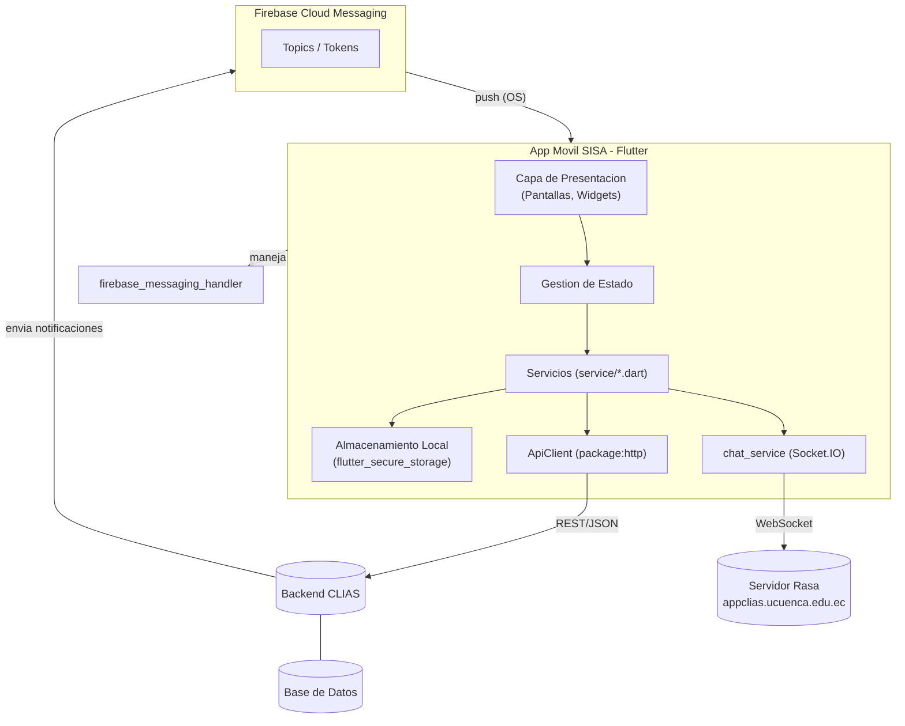
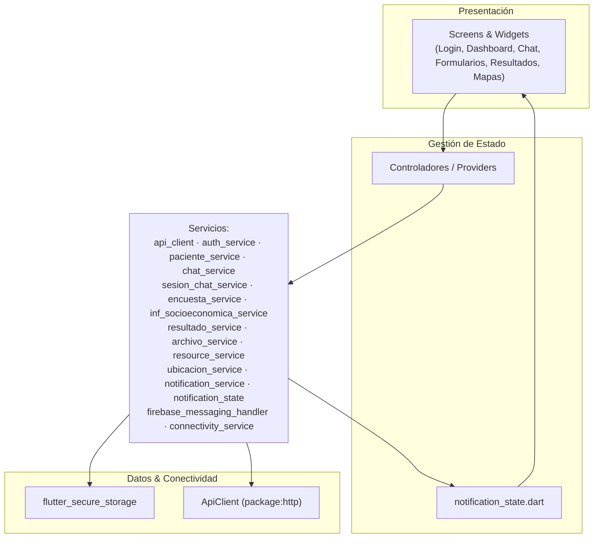
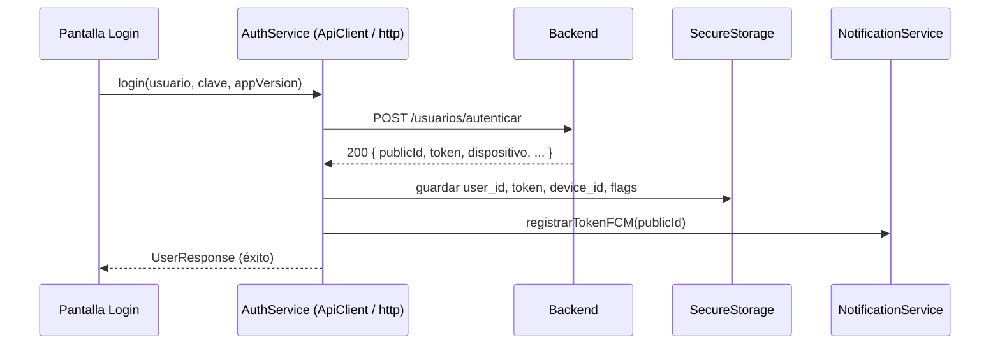
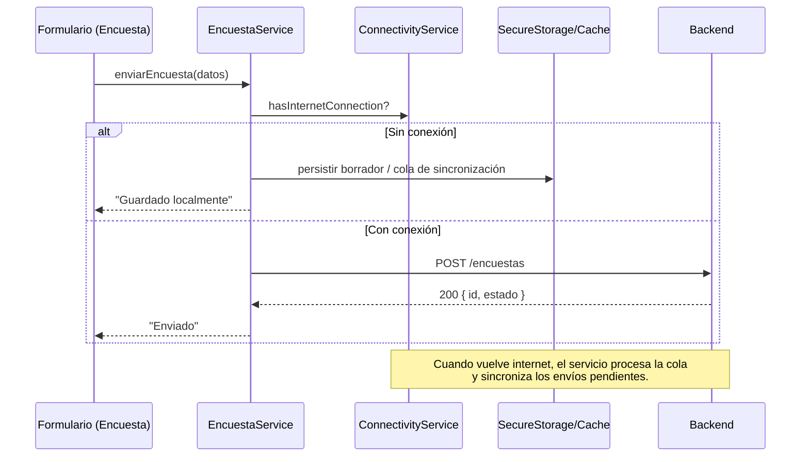
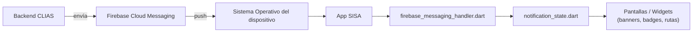
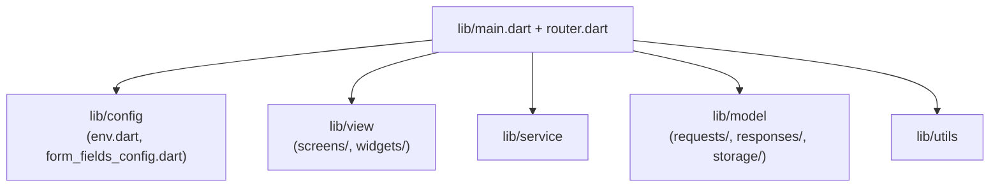
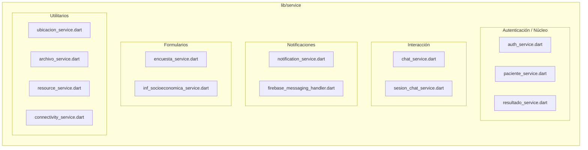
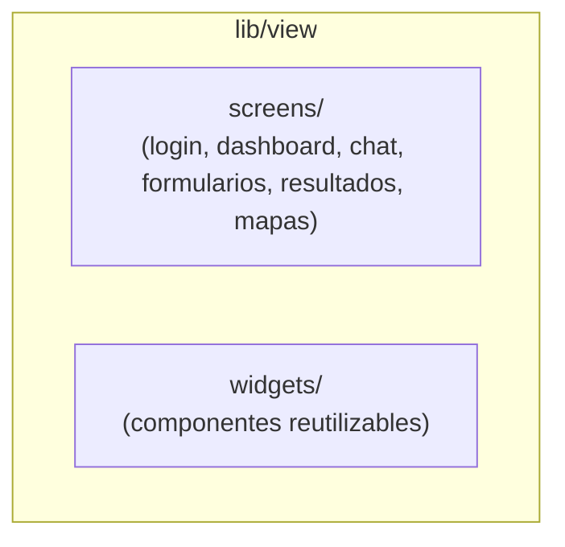

# Arquitectura General

Esta sección describe **cómo está organizada la *app* móvil SISA** a nivel de capas, módulos y flujos internos, y **cómo se integra** con los servicios de backend y con **Firebase Cloud Messaging (FCM)** para notificaciones. El foco es la **aplicación móvil**; se citan componentes del backend solo cuando es imprescindible para entender la integración.

:::note
La documentación en inglés ([DeepWiki – TelemedicinaApp](https://deepwiki.com/chr1s23/TelemedicinaApp)) es de referencia y no siempre refleja los módulos más recientes. Aquí se presenta la **versión actualizada** aplicada a SISA.
:::

## Vista de Alto Nivel (App – Servicios – Backend)

**Claves de la vista:**

- La *app* está organizada en **Presentación → Estado → Servicios → Almacenamiento/HTTP**.
- Los **Servicios** encapsulan la comunicación con el backend y la gestión local (segura y caché). El HTTP REST va por `ApiClient` (paquete `http`); el **chatbot** usa un **WebSocket Socket.IO** directo al servidor Rasa.
- Las **notificaciones** se envían desde el backend a **FCM**, y el dispositivo las recibe a través del **handler** nativo/Flutter.
- La navegación se resuelve con **`go_router`** (`lib/router.dart`).

### Las tres capas principales

**Capa de Presentación (Pantallas, Widgets)**

Se encarga únicamente de mostrar los datos al usuario y de recolectar sus interacciones. Ejemplos: pantalla de login, formularios de encuestas, dashboard de resultados.

**Gestión de Estado**

Representa la capa intermedia donde se mantiene la información viva de la aplicación. Aquí se conserva y actualiza el estado actual de la app, como:

- Usuario autenticado.
- Notificaciones disponibles.
- Encuestas pendientes de envío.

En **SISA**, un ejemplo concreto es el archivo `notification_state.dart`, que administra el estado de las notificaciones recibidas y asegura que la interfaz se actualice en tiempo real.

**Servicios (`service/*.dart`)**

Son responsables de ejecutar la lógica "externa":

- Comunicarse con el backend vía API REST (paquete `http`, a través de `ApiClient`).
- Guardar y recuperar datos en `SecureStorage` o en caché.
- Registrar y manejar el token en **Firebase Cloud Messaging (FCM)**.

:::tip
La "Gestión de Estado" no corresponde a un archivo específico, sino a un **patrón de diseño** que organiza cómo la UI interactúa con los servicios. Así la app permanece coherente, extensible y preparada para manejar conectividad limitada.
:::

## Arquitectura Interna de la App (capas y módulos)

**Ideas clave:**

- Los servicios están **desacoplados** de la UI y de la gestión de estado.
- `connectivity_service.dart` define el **comportamiento offline-first** (validar conexión antes de llamar al backend y sincronizar cuando vuelve internet).
- `firebase_messaging_handler.dart` + `notification_state.dart` gobiernan el **ciclo de vida de notificaciones** (foreground/background/taps).

## Estrategia Offline-First y Manejo de Errores

- **Verificación de conectividad:** antes de cualquier operación de red, la app consulta `connectivity_service.dart`.
- **Almacenamiento temporal/local:** formularios, encuestas y datos sensibles se guardan en `SecureStorage`/caché hasta su sincronización.
- **Sincronización diferida:** cuando vuelve la conectividad, los servicios **reintentan** el envío/actualización.
- **Manejo de errores:** respuestas estandarizadas (timeouts, 401/403, 5xx); en caso de 401/403, **limpieza de sesión y redirección a Login**.

**Secuencia — Inicio de sesión y registro de token FCM**

**Secuencia — Operación offline con sincronización posterior**

## Flujo de Notificaciones Push en SISA

El siguiente diagrama describe cómo viaja una notificación desde el backend hasta la interfaz del usuario:

1. **Backend CLIAS** → genera un evento (resultado disponible, recordatorio) y envía una notificación estructurada a **FCM** con el `token` del dispositivo o el `topic` correspondiente.
2. **Firebase Cloud Messaging (FCM)** → actúa como intermediario en la nube y direcciona la notificación al sistema operativo del dispositivo registrado, incluso con la app en segundo plano.
3. **Sistema Operativo (Android/iOS)** → recibe el push y lo despacha a la app. Si está cerrada, muestra una notificación nativa en la bandeja; si está abierta, envía el evento directamente.
4. **App SISA** → capta la notificación y la deriva al **handler** de Flutter, que decide si se muestra como banner, badge o redirección.
5. **`firebase_messaging_handler.dart`** → gestiona la recepción, diferencia entre **foreground**, **background** y **terminated**, y estandariza los datos antes de pasarlos al estado global.
6. **`notification_state.dart`** → mantiene el estado de las notificaciones (leídas/no leídas) y reactiva la interfaz cuando llega una nueva alerta.
7. **Pantallas / Widgets (UI)** → reflejan la información al usuario mediante **banners**, **badges** y **rutas** de redirección automática.

:::tip Idea central
El flujo garantiza que **todas las notificaciones viajen desde el backend hasta el usuario final**, independientemente del estado de la aplicación (abierta, minimizada o cerrada).
:::

## Relación con el Modelo de Datos

- La app **consume/produce** entidades que se corresponden con el **modelo de datos del backend**.
- Desde la app se gestionan: **Paciente, CuentaUsuario, Dispositivo, Sesión de Chat, Exámenes/Resultados, Archivos**, entre otros.
- La app no accede directamente a la base de datos; opera mediante **APIs REST** y mapea las respuestas a **modelos locales** para persistencia temporal y renderizado en UI.

:::note
El diagrama ERD de referencia lo provee el equipo de backend (ver [Base de Datos](../backend/db.md)); esta documentación se centra en el cliente móvil.
:::

## Consideraciones de Diseño

- **Modularidad:** cada servicio encapsula una funcionalidad del dominio (auth, chat, encuestas, socioeconómico, resultados, archivos, ubicación, notificaciones).
- **Trazabilidad:** logs consistentes (errores y eventos clave) facilitan soporte y auditoría.
- **Extensibilidad:** nuevos formularios o flujos reutilizan la misma ruta: UI → Estado → Servicio → Almacenamiento/HTTP → Backend.
- **Seguridad:** uso de **JWT** en cabeceras, almacenamiento mínimo en dispositivo y respeto de políticas de privacidad.

## Estructura de Directorios (guía general)

La aplicación SISA mantiene una estructura modular dentro de la carpeta `lib/`.

**Vista general del árbol `lib/`**

El paquete Dart se llama **`chatbot`** (los `import` son `package:chatbot/...`). El almacenamiento seguro vive en `lib/model/storage/storage.dart`.

**Detalle de `lib/service/`** — servicios agrupados por dominio

**Detalle de `lib/view/`** — pantallas y componentes reutilizables

### ¿Qué sigue?

En los siguientes capítulos se detallan **Módulos Principales**, **Servicios y APIs** y **Configuración y Despliegue**, reutilizando los diagramas y convenciones presentados en esta arquitectura.
