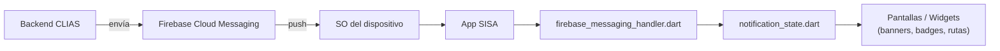
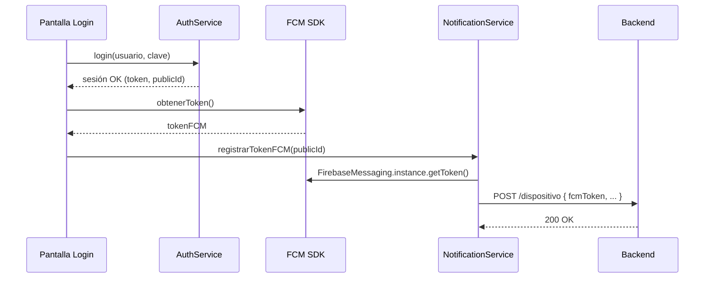
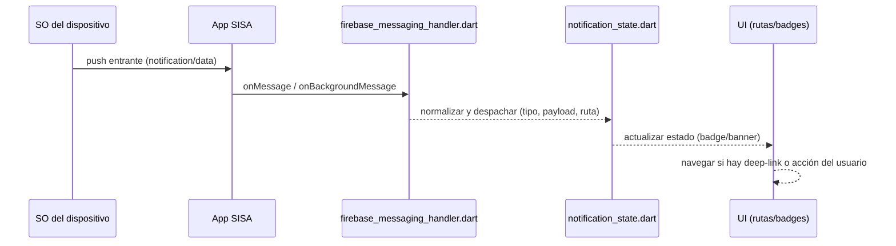

# Notificaciones Push (FCM)

Esta sección resume **cómo SISA integra Firebase Cloud Messaging (FCM)**, el **flujo extremo a extremo** desde el backend hasta la app.

## Componentes involucrados

- **`notification_service.dart`**: registro/actualización del token FCM y utilitarios del módulo.
- **`firebase_messaging_handler.dart`**: recepción y normalización del mensaje (foreground, background, terminated).
- **`notification_state.dart`**: estado de notificaciones (banners, badges, bandeja, rutas).

## Puntos clave de la integración

- El **token FCM** se obtiene/actualiza tras un login exitoso y se **registra en el backend** vinculado al `publicId` del usuario.
- Se distinguen **dos tipos de payload**:
  - **`notification`**: mostrado por el SO cuando la app está en background/terminated.
  - **`data`**: para *deep-links* y lógica personalizada; funciona en todas las situaciones.

**Requisitos:**

- Proyecto Firebase configurado para la app (Android/iOS).
- Permisos de notificaciones habilitados en el SO (Android 13+ requiere *prompt*).
- Backend con endpoint para registrar el **token FCM** por usuario/dispositivo.

## Flujo completo (Backend → App)

1. El backend emite un evento (ej. **resultado listo**, **recordatorio**).
2. Envía un push a **FCM** (a **token** o **topic**).
3. El **SO** entrega la notificación al dispositivo; si la app está en background, muestra notificación nativa.
4. La **App SISA** invoca `firebase_messaging_handler.dart` para normalizar el mensaje.
5. Se actualiza el **estado** en `notification_state.dart`.
6. La **UI** reacciona (banner, badge, navegación por *deep-link*).

## Registro / renovación del token (secuencia)

## Manejo del mensaje en la app (secuencia)

## Casos a cubrir por estado de la app

| Estado | Comportamiento |
|--------|----------------|
| **Foreground** | Mostrar banner/diálogo y actualizar contadores |
| **Background** | Al tocar notificación, navegar a la pantalla (deep-link) |
| **Terminated** | Abrir app con ruta objetivo (*pending notification*) |

## Casos de uso principales

| Caso | Descripción | Acción en la app |
|------|-------------|-----------------|
| `RESULTADO` | Notifica resultado listo | Marcar leída → validar **ficha socioeconómica** y **encuesta** → navegar a **Resultado** (`mostrarResultadoDesdeContexto`), **LikertSurveyPage** o **RequiredSocioeconomicForm** |
| `RECORDATORIO_NO_EXAMEN` | Retomar flujo principal | Ir a **Dashboard** → `irAPestanaPrincipal()` |
| `RECORDATORIO_NO_ENTREGA_DISPOSITIVO` | Confirmar entrega de dispositivo | Mostrar diálogo → si **Sí**: `desactivarRecordatorioEntrega(userId)` + SnackBar |
| **Acción con enlace** (`accion`) | Externo o interno | Si **externo**: diálogo + `launchUrl(...)` · Si **interno**: `irAPestanaRecursos()` |

Otros casos

- **Foreground:** notificación local con `FlutterLocalNotificationsPlugin.show(...)`, refrescar **Dashboard**/**Notifications**, `NotificacionFlags.hayNotificacionNueva = true`.
- **Apertura desde notificación (background/terminated):** `getInitialMessage()` / `onMessageOpenedApp` → `actualizarNotificacionesEnMemoria()` → `manejarClickNotificacion(data)`.
- **Bienvenida local:** `mostrarNotificacionBienvenidaLocal()` con `AndroidNotificationDetails`.

## Buenas prácticas

- Reintentar el registro del token si falla (con backoff).
- Actualizar el token cuando **FCM lo renueva** (evento de *token refresh*).
- Usar `launchUrl(...)` para notificaciones con enlace externo.
