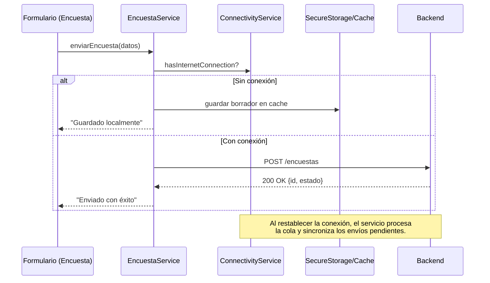

# Servicios y APIs

En SISA, la lógica de comunicación con el backend y la gestión local de datos está encapsulada en los archivos `*_service.dart`.

## Descripción general de los servicios

| Servicio | Responsabilidad |
|----------|----------------|
| `api_client.dart` | `ApiClient`: centraliza `baseUrl`, construcción de `Uri` y headers (`authHeaders()` con el JWT de `secureStorage['user_token']`, `publicHeaders`) |
| `auth_service.dart` | Autenticación, emisión y renovación de tokens, cierre de sesión |
| `paciente_service.dart` | CRUD de información de pacientes; registro de dispositivo/kit |
| `chat_service.dart` | Mensajería en tiempo real con Rasa vía **Socket.IO** (`socket_io_client`) |
| `sesion_chat_service.dart` | Persistencia de sesiones de chat/automuestreo en el backend (REST) |
| `encuesta_service.dart` | Gestión de encuestas de salud y SUS (creación, envío, estado) |
| `inf_socioeconomica_service.dart` | Formularios de datos socioeconómicos |
| `resultado_service.dart` | Consulta de resultados de exámenes |
| `archivo_service.dart` | Subida y descarga de archivos vinculados a formularios y resultados |
| `resource_service.dart` | Recursos educativos (blogs) y `aumentar-vista` |
| `ubicacion_service.dart` | Consulta de ubicaciones de servicios (`/api/ubicaciones`) |
| `notification_service.dart` | Integración con FCM, marcado de leídas, desactivación de recordatorios |
| `notification_state.dart` | Estado en memoria de las notificaciones (badges, banners) |
| `firebase_messaging_handler.dart` | Recepción y normalización de mensajes push |
| `connectivity_service.dart` | Verificación de red y soporte al modo offline |

## Interacción con el backend

Los servicios se comunican con el backend **mediante HTTP (REST/JSON)** con el paquete **`http`**, a través de `ApiClient` (no se usa Dio). El chatbot es la excepción: `chat_service.dart` abre un **WebSocket Socket.IO** contra el servidor Rasa (`https://appclias.ucuenca.edu.ec`).

Flujo general:

1. La **UI** solicita una acción (ej. enviar encuesta).
2. El **estado** invoca el servicio correspondiente.
3. El servicio valida conectividad (`connectivity_service.dart`).
4. Si hay red → realiza la llamada HTTP al endpoint del backend.
5. Si no hay red → guarda un borrador en caché para sincronización posterior.
6. El backend responde con datos o confirmación.
7. El servicio transforma la respuesta en modelos locales.

## Manejo de errores y respuestas

**Tipos de errores comunes:**

- **401 / 403 (no autorizado)**: limpiar sesión y redirigir a Login.
- **500 (error del servidor)**: informar al usuario con un mensaje genérico y permitir reintentos.
- **Timeout / sin conexión**: almacenar el intento en cache para sincronización posterior.

**Buenas prácticas:**

- Uso de `try/catch` para capturar `DioException` y mostrar feedback mediante `SnackBar`.
- Normalización de errores en objetos de respuesta estandarizados.
- Reintentos automáticos en casos de conectividad intermitente.
- Logging de errores técnicos (sin datos sensibles).

## Ejemplo de secuencia (encuesta con modo offline)

## Checklist para trabajar con servicios

- Siempre validar conexión antes de llamadas HTTP.
- Manejar tokens en cabecera con `auth_service`.
- Convertir respuestas JSON en modelos locales claros.
- Nunca exponer credenciales en logs.
- Implementar feedback inmediato al usuario (sin conexión, error, éxito).
