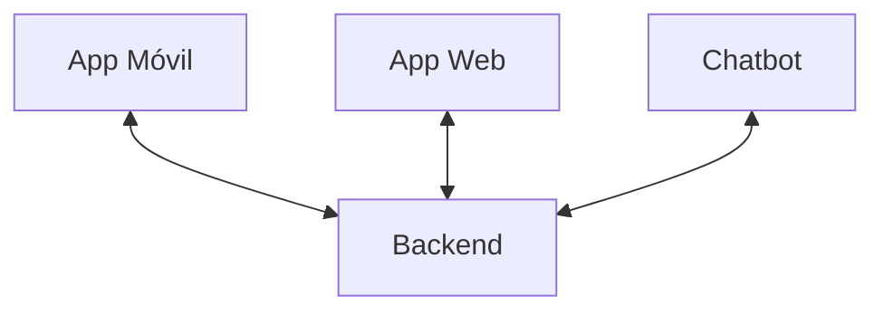

# CLIAS - IA en la Promoción de Automuestreo para la Detección Temprana de VPH

Bienvenido a la documentación oficial del proyecto **CLIAS** (IA en la Promoción de Automuestreo para la Detección Temprana de VPH en la Prevención del Cáncer de Cuello Uterino).

Este proyecto busca fortalecer la **prevención y diagnóstico temprano** del Virus del Papiloma Humano (VPH) mediante el uso de inteligencia artificial, aplicaciones móviles, una plataforma web y un asistente conversacional (chatbot).

## Arquitectura general

El ecosistema de CLIAS se compone de los siguientes módulos principales:

- **Backend**: Servicios en Kotlin que gestionan la lógica central, base de datos y APIs.
- **Aplicación Móvil**: Desarrollada en Flutter, permite a los usuarios finales interactuar con el sistema.
- **Aplicación Web**: Panel de administración y monitoreo para profesionales de salud.
- **Chatbot**: Módulo de apoyo interactivo para orientación y resolución de dudas.

## Recursos rápidos

- [Repositorio Backend](https://github.com/chr1s23/TelemedicinaBE)
- [Repositorio App Móvil](https://github.com/chr1s23/TelemedicinaApp)
- [Repositorio Web Admin](https://github.com/midaro99/telemedicina_web)
- [Portal oficial](https://clias.ucuenca.edu.ec)
- [Preguntas frecuentes](/user/faq)

## Equipo y créditos

El proyecto **IA - VPH** es el resultado del trabajo colaborativo de un grupo de investigación interdisciplinario integrado por las **Facultades de Ciencias Médicas, Ciencias Químicas e Ingeniería** de la **Universidad de Cuenca**.

Este esfuerzo conjunto combina la experiencia en salud, química, tecnología e ingeniería, con el objetivo de aportar soluciones innovadoras para la **detección temprana del Virus del Papiloma Humano (VPH)** y la **prevención del cáncer de cuello uterino**.
